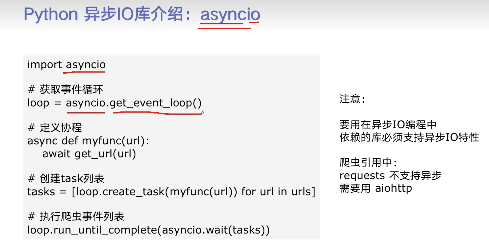

# Markdown使用教程

markdown分为块级元素和行内元素，块级元素独占一行或几行，行内元素只占用自己需要的空间大小。

## 一、块级元素

### 1、标题

标题共分有六级 使用#号，1个代表一级标题，2个代表二级标题，...6个代表6级标题

语法：

```md
# 一级标题
## 二级标题
### 三级标题
#### 四级标题
##### 五级标题
###### 六级标题
```


### 2 、引用

引用使用 > 来使用

语法：

```md
> 引用内容
```


> 这是一段引用 

### 3、列表

有序列表 使用1. 2. 3. ....

语法：

```md
1.
2.
3.
```


把大象装进冰箱里：

1. 打开冰箱

2. 把大象放进冰箱
3. 关上冰箱

无序列表 语法：

```md
- 列表元素
```

- 张三
- 李四
- 王二麻子

可勾选列表 

语法：

```md
可勾选列表未勾中：- [ ]
可勾选列表已勾中：- [x]
```

- [ ] 吃饭
- [x] 睡觉
- [ ] 打豆豆

### 4、代码块

使用三个反引号```<语言名称>

```py
class Person:
	name = '张三'
	age = 18
	gender = male
```

### 5、数学公式

语法：使用四个$符号，前面两个，后面两个

```md
$$公式内容$$
```


$$
a^2 - b^2 = (a+b)(a-b)
$$

### 6、表格

使用|:---|:---:|---:|，冒号在左边代表左对齐，右边代表右对齐，两边都有代表居中对齐。typora可以智能调节，可能不支持对齐的使用

语法：

```md
|---|---|---|
```


| 姓名 | 年龄 | 性别 |
| :--- | :--: | ---: |
| 张三 |  18  |   男 |

### 7、脚注

脚注链接：使用方括号和^号[^（脚注名字）] 

语法:

```md
[^(脚注名称)]
```


脚注解释：使用符号相同后面再加一个英文冒号:

语法：

```md
[^(脚注名称)]: 注释内容
```


一键三连[^三连]

### 8、横线

使用三个 - 号，可以将内容分割为几部分

语法：

```md
---
```

---

## 二、行内元素

### 1、链接

1.直接使用链接，使用方括号里面放链接文本加小括号里面放链接地址 

语法：

```md
[链接文本](链接地址 "鼠标悬停时显示文本")
```

​	[百度](baidu.com "百度一下") 

2.引用链接，如果一个链接会被多次用到可以将链接地址拿出来写，引用的地方用两个方括号，一个放链接文本，一个放链接id，id用作链接地址的标记 

语法：

```md
[百度][id]
[id]:baidu.com "百度一下"
```

​	[谷歌][id1] 

​	[google2][id1]

[id1]: http://www.google.com "Google链接"

3.标题链接，使用方括号+小括号#标题

语法：

```md
[1、链接](###1、链接)  小括号哪标题需要同要转到的链接的标题写法一模一样
```

​	请参考[4、代码块](###4、代码块)

4.直接输入标准URL，会自动识别

语法：

```md
https://xxxx.xxx
```

​	URL: http://www.baidu.com


### 2、图片

使用方括号名称+小括号图片链接鼠标放图片上时的名字 [百度](http://www.baidu.com/img/PCtm_d9c8750bed0b3c7d089fa7d55720d6cf.png)

语法：

```md
 图片链接可以是本地，也可以是网上资源
```

​	 

### 3、其他行内元素

1.斜体：使用一对星号, *这是斜体*

语法

```md
*斜体内容*
```


2.加粗：使用两对星号，**这是粗体**

语法：

```md
**粗体内容**
```


行内代码：使用一对反引号，`print(x)`

语法：

```md
`代码内容`
```


下划线：使用一对u标签，<u>这是下划线</u>

语法：

```md
<u>加下划线内容</u>
```


表情符号：使用国际表情符号通用代码，:smile:

语法：

```md
:smile:
```


行内数学公式：使用一对,$ $\theta=x^2$ 。

语法：

```md
$数学公式内容$
```


下标：使用一对波浪号，H~2~0 （没起作用）

语法：

```md
H~2~O
```


上标：使用一对尖冒号，x^2^（没起作用）

语法：

```md
X^2^
```


高亮文字：使用两对等号，==这是一段高亮文字==（没起作用）

语法：

```md
==需要高亮的文字==
```


嵌入代码

<iframe src="//player.bilibili.com/player.html?aid=327623069&bvid=BV1JA411h7Gw&cid=171385214&page=1" scrolling="no" border="0" frameborder="no" framespacing="0" allowfullscreen="true"> </iframe>

[^三连]: 点赞、投币、收藏

